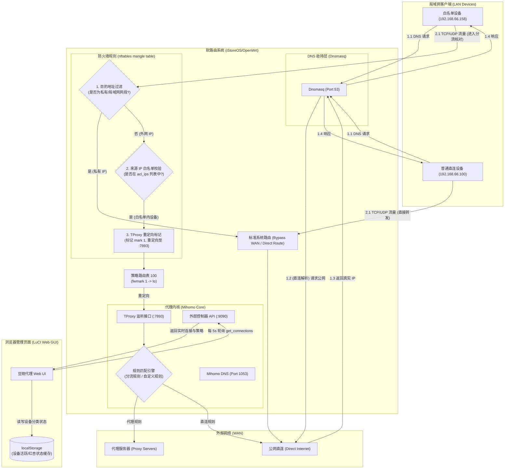
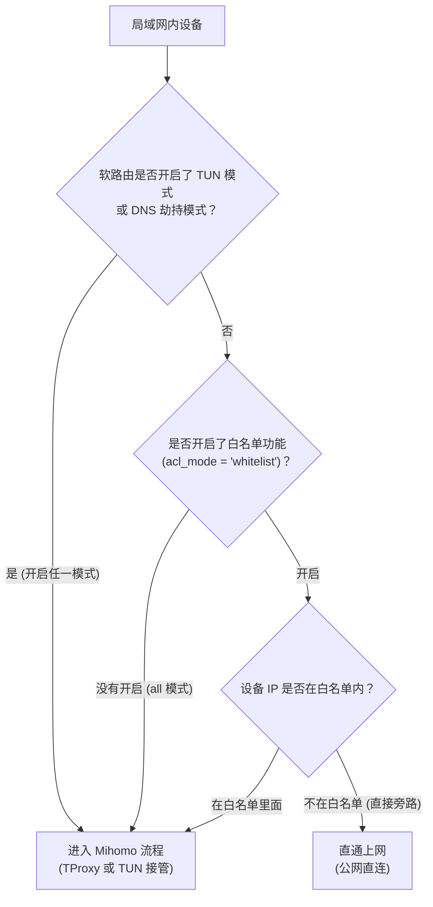

# luci-app-mihomo

轻量级 OpenWrt LuCI 客户端 —— 用于管理 Mihomo (Clash Meta) 代理核心，集成 Firewall4 (nftables) 实现透明代理与流量精细化管控。

---

## 🚀 核心特性

- **TProxy 透明代理**：支持 TCP/UDP 流量的 TProxy 透明代理劫持（使用 nftables `inet mihomo` 表与策略路由表 `100`），无需启用 TUN 即可接管局域网网关流量。
- **DNS 劫持**：支持劫持系统 Dnsmasq 请求，并无缝转发给 Mihomo 内置的 DNS 服务，支持防止 DNS 污染与解析加速。
- **定时订阅更新**：内置 cron-like 的自动更新守护线程，支持自定义小时级间隔重新获取节点订阅。
- **局域网 IP 转发控制（ACL 白名单）**：支持在常规设置中配置客户端转发模式：
  - **所有设备**：劫持局域网所有设备的流量；
  - **仅允许列表中的设备**：精细化设置仅指定的客户端 IP/子网网段走代理，非列表设备完全在内核态直接旁路直连，性能极高。
- **实时连接与历史记录（全环境兼容）**：
  - 实时展现活跃 TCP/UDP 连接状态，提供上/下载流量、出站策略及匹配的分流规则；
  - 提供后台每 15 秒增量持久化落盘的历史访问数据监控；
  - **全环境兼容**：使用 BusyBox/OpenWrt 原生支持的 `awk` 算法实现了逆序和编号，解决了由于低配固件裁剪 `tac`、`nl` 等工具造成的日志空数据缺陷。
- **实时过滤搜索**：连接监控页支持一键搜索过滤，可实时匹配 IP、设备名、策略名、域名和分流规则。
- **快捷创建与独立规则管理**：
  - 支持在日志监控中直接点击连接旁的操作按钮一键将目标域名加入“代理 / 直连 / 拦截”；
  - **规则管理解耦**：设立了独立的「规则管理」页面，统一查看、配置和一键「应用并重启」生效自定义规则（注入核心分流最顶部优先匹配）。
- **动态端口与鉴权兼容**：后台自动提取当前运行配置中的 `external-controller` 端口与 `secret` 密钥，保证管理面板与 API 调用的正确鉴权。

---

## 🛠️ 核心架构

本项目采用 **“单源真相 (Single Source of Truth)”** 架构：
- 仓库唯一的源文件为 `build_ipk.py`，所有的二进制/脚本/静态界面文件均作为字符串内嵌在脚本顶部的 `src_files` 字典中。
- `src/` 目录以及编译出的 `.ipk` 文件完全是通过脚本动态创建的。
- **请勿手动编辑 `src/` 目录下的文件**，因为所有修改都会在下一次执行编译时被先删后建覆盖。

### 运行时多文件协作关系
- **`/etc/init.d/mihomo`**：主启动服务（START=95），在后台使用 `procd` 守护拉起 3 个实例：
  1. **Mihomo 核心实例**：自动提取订阅并完成受控端口、DNS与 TUN 的动态配置合并后以 `/tmp/mihomo_run.yaml` 启动；
  2. **连接采集守护实例**：后台以 15s 间隔持续提取 connections 状态并写入 `/tmp/mihomo_access.log`；
  3. **定时更新循环实例**：按指定的时间间隔触发订阅文件更新与核心热重启。
- **`/usr/share/mihomo/helper.sh`**：单体后端工具，封装了包含节点延时测试（`test_all_nodes` 并发）、订阅 YAML 解析（兼容 YAML 格式）、流量提取与 ACL 读写在内的 20 余个子命令。
- **LuCI 前端 (纯 JS UI)**：
  - **`dashboard.js` (运行状态)**：显示状态仪表盘、策略组实时热切换面板、节点列表、批量延时测试及系统日志；
  - **`settings.js` (服务设置)**：UCI 常规与高级参数可视化设置（订阅链接、自动更新、TUN、DNS、白名单模式与 IP 列表）；
  - **`accesslog.js` (访问日志)**：展示 5s 轮询的实时连接（带模糊搜索）与历史访问日志；
  - **`rules.js` (规则管理)**：提供 UCI 自定义域名规则的管理和一键应用。

### 🔄 数据流向与系统架构

> 📌 **前置条件说明：** 本拓扑图展示的是**「白名单分流模式生效时（即关闭全局 DNS 劫持与 TUN 模式）」**的数据流向。若开启了全局 DNS 劫持或 TUN 模式，决策逻辑将强制转入全局接管，普通直连设备 `devB` 也会同等被导入 Mihomo。



### 🧠 决策分流逻辑分支 (Decision Tree)

当任意局域网客户端发起外网请求时，系统在底层的判定分流逻辑路径如下：



---

## 📦 编译与部署

### 1. 编译构建
本项目仅依赖 Python 3 标准库（`tarfile`、`shutil` 等），无需任何第三方 Python 包或虚拟环境。在仓库根目录下运行：

```bash
python3 build_ipk.py
```

- **说明**：构建成功后，会在 `dist/` 目录下生成 `luci-app-mihomo_<version>_all.ipk` 包。
- 每次构建成功时，`PKG_VERSION` 变量会自动递增（例如从 `1.0.0-90` 变为 `1.0.0-91`）并原地改写脚本，此为预期行为。

### 2. 一键自动推送与安装
如果您在 macOS 开发机上进行编译，可以使用已配置好的 [deploy.sh](deploy.sh) 自动化上传并升级到您的软路由器中（该脚本利用系统内置的 `expect` 来处理密码交互，免额外依赖）：

```bash
./deploy.sh
```

**该部署脚本会依次执行**：
1. 自动寻找 `dist/` 下最新时间的 `.ipk` 包；
2. 通过 SCP 上传到软路由的 `/tmp/` 目录；
3. 连接 SSH 执行安装：`opkg install /tmp/luci-app-mihomo_*.ipk`；
4. 自动热重启软路由上的 `mihomo` 服务使脚本和配置立即生效。

也可以将编译与部署合并为单行指令：
```bash
python3 build_ipk.py && ./deploy.sh
```

> 💡 **基本开发规则：** 每次构建新版本后，**必须**将最新生成的 IPK 部署推送至服务器（软路由），以保证测试环境上的运行代码与本地保持一致。推荐始终使用上述合并指令进行开发调试。

---

## ⚙️ 局域网白名单配置示例

若您希望在局域网中**仅允许特定设备走代理**，而非接管全局：
1. 访问路由器管理界面，进入 **Mihomo 代理** -> **服务设置**。
2. 找到 **IP 转发控制模式**，将其切换为 **仅允许列表中的设备**。
3. 在下方的 **受控 IP 列表** 中，添加允许走代理的设备 IP 或网段，例如：
   - `192.168.66.158` (开发机)
   - `192.168.66.0/24` (整条子网网段)
4. 保存并应用，服务重启后即可在内核级进行流量按源过滤。

---

## 📂 项目结构

```
.
├── build_ipk.py       # 唯一主源码文件（构建器 + 内嵌交付文件包）
├── deploy.sh          # expect 推送部署脚本（免依赖）
├── CLAUDE.md          # 开发者规范与快捷指南
├── AGENTS.md          # 核心架构简介
├── dist/              # 编译产出的 IPK 安装包目录
├── docs/              # 功能开发设计与调测设计文档
│   ├── access-log-design.md
│   ├── proxy-group-management-design.md
│   └── debugging-node-delay-test.md
└── src/               # 编译临时生成的解包源码树（切勿在此目录手动改动文件）
```
