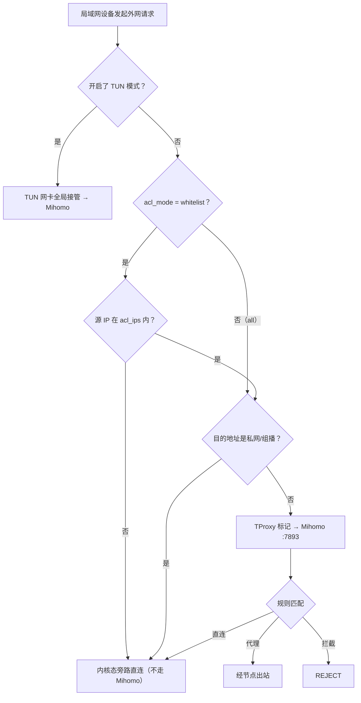

# 水杉代理 · luci-app-ssproxy

<p align="center">
  
</p>

> 面向 iStoreOS / OpenWrt（Firewall4 + nftables）的轻量 LuCI 代理客户端，作为 [Mihomo (Clash Meta)](https://github.com/MetaCubeX/mihomo) 核心的前端，在软路由网关上提供 TProxy 透明代理、按设备白名单、订阅自动更新、访问日志与流量统计。

把代理能力下沉到网关——局域网设备**零配置**，经过路由器的流量即按规则分流（代理 / 直连 / 拦截）。

---

## ✨ 核心特性

- **TProxy 透明代理**：nftables `inet mihomo` 表 + 策略路由表 100，TCP/UDP 透明接管，**无需 TUN**；IPv4 + IPv6 双栈。
- **DNS 劫持 + 按设备白名单共存**：`仅允许列表中的设备` 模式可与 DNS 劫持同时开启——仅白名单设备的 DNS 被重定向到 Mihomo（fake-ip）并走代理，其余设备用真实 DNS 直连（nft 按源 DNAT，非白名单设备内核态旁路、零开销）。
- **订阅自动更新**：自包含守护循环（10 分钟轮询、小时间隔节流），订阅链接持久化、卸载重装也不丢；支持「订阅 / 仅自定义 / 混合」三种配置模式。
- **节点与延时**：策略组实时热切换（选择持久化）、单节点与全量批量延时测试（后端有限并发，不打满 rpcd）、连通性测试与自动选节点。
- **访问日志**：5s 实时连接（上下行 / 出站策略 / 命中规则 + 模糊搜索）+ 15s 历史落盘；连接旁一键加「代理 / 直连 / 拦截」规则。
- **规则管理**：独立页面管理 UCI 自定义规则（域名 / 关键字 / 后缀 × 代理 / 直连 / 拦截），批量导入、一键应用并重启，注入分流最顶部最高优先。
- **流量统计**：按域名分桶（可清零）+ 永久累计总量 + 按天 / 按月汇总（北京时间）。
- **商业化加固**：控制器密钥自动生成、Geo 数据库（GeoIP/GeoSite）镜像与自动更新、节点选择持久化。
- **可复现构建**：单源文件 `build_ipk.py` 内嵌全部交付物，仅依赖 Python 3 标准库，构建产物逐字节一致；每次构建自动版本自增 + 生成发布说明。

---

## 🧱 核心架构

**单源真相（Single Source of Truth）**：仓库唯一源文件 `build_ipk.py` 既是构建器，又以字符串内嵌全部要打包的文件（shell / UCI / LuCI JS / JSON），集中在顶部 `src_files` 字典。

- 改任何交付文件 = 改 `src_files` 对应字符串，再 `python3 build_ipk.py`。
- `src/` `build/` `dist/` 是构建「先删后建」的纯产物，**切勿手编**。

**运行时** `/etc/init.d/mihomo`（`START=95`）拉起 4 个 procd 实例：

1. **核心**：恢复订阅 → `prepare_config` 生成 `/tmp/mihomo_run.yaml` → 启动 Mihomo → `enable_tproxy` → 按需 `enable_dns_hijack`。
2. **连接采集器**：每 15s 去重持久化连接到 `/tmp/mihomo_access.log`。
3. **自动更新循环**：每 10 分钟轮询（自包含，不依赖 cron）。
4. **流量统计循环**：每 5s 累计代理字节。

后端 `/usr/share/mihomo/helper.sh` 为单体工具，`case` 分发约 30 个子命令（架构 / 订阅 / 配置合并 / 实时控制 / 规则 / 流量 / Geo）。前端 4 个纯 JS 视图：`dashboard.js`（运行状态）、`settings.js`（服务设置）、`accesslog.js`（访问日志）、`rules.js`（规则管理）。

### 分流决策树



> 自 `1.0.0-160` 起，**白名单可与 DNS 劫持共存**：白名单设备的 DNS 被按源地址 DNAT 到 Mihomo（fake-ip），非白名单设备保留真实 DNS 直连。详见 [`docs/whitelist-dns-coexistence-design.md`](docs/whitelist-dns-coexistence-design.md)。

---

## 🚀 快速开始

### 构建

仅依赖 Python 3 标准库，无需虚拟环境或第三方包：

```bash
python3 build_ipk.py            # 产出 dist/luci-app-ssproxy_<version>_all.ipk
```

每次构建会自增 `PKG_VERSION` 并原地重写脚本（预期行为），同时生成 `dist/releaseNote.md`。

### 一键部署到软路由（macOS）

`deploy.sh` 用系统自带 `expect` 处理密码，SCP 上传 → `opkg install` → 重启服务：

```bash
python3 build_ipk.py && ./deploy.sh
```

> 基本规则：每次构建新版本后**必须**部署安装到软路由，保证远程测试环境与本地代码同步。

### 首次使用

1. 路由器 LuCI 进入「Mihomo 代理 → 服务设置」，填入**订阅链接**并保存。
2. （可选）`IP 转发控制模式` 选「仅允许列表中的设备」，在「受控 IP 列表」填入要走代理的设备 IP/CIDR（如 `192.168.66.158`、`192.168.66.0/24`、`fd00::158`）。
3. 「劫持系统 DNS」可按需开启——在白名单模式下仅劫持列表内设备。
4. 保存应用，服务自动重启生效。

---

## 📂 项目结构

```
.
├── build_ipk.py        # 唯一源文件：构建器 + 内嵌交付物（src_files）
├── deploy.sh           # expect 自动部署（scp + opkg + 重启）
├── tests/              # pytest 套件（构建器 + helper.sh 黑盒）
├── docs/               # 设计文档与测试用例
│   ├── 产品设计文档.md              # 整体产品设计（权威）
│   ├── whitelist-dns-coexistence-design.md
│   ├── whitelist-test-cases.md
│   ├── config-rules-guide.md
│   └── ...
├── CLAUDE.md           # 开发者规范
├── CHANGELOG.md        # 历史变更
├── README.md
├── src/ build/ dist/   # 构建产物（自动生成，勿手编）
└── .release_baseline   # releaseNote 的 git 基线
```

---

## 🧪 测试

```bash
python3 -m pytest tests/ -q       # 需 pytest（见 tests/README.md）
```

覆盖构建器（版本自增、tar 打包、可复现性、端到端）与 `helper.sh` 子命令黑盒（`prepare_config`、`get_proxies`、访问规则、`emit_tproxy_rules`、LAN IP 探测等）。

---

## 📚 文档

- [产品设计文档](docs/产品设计文档.md) — 整体设计（功能矩阵 / 架构 / 数据流 / 机制详解 / 路线图）
- [CHANGELOG.md](CHANGELOG.md) — 历史变更汇总
- [CLAUDE.md](CLAUDE.md) — 开发者规范与约定
- [白名单 + DNS 劫持共存设计](docs/whitelist-dns-coexistence-design.md)
- [分流测试用例](docs/whitelist-test-cases.md)
- [订阅配置与分流规则说明](docs/config-rules-guide.md)
- [LuCI 插件通用开发流程](docs/LuCI插件自动化闭环开发流程.md)

