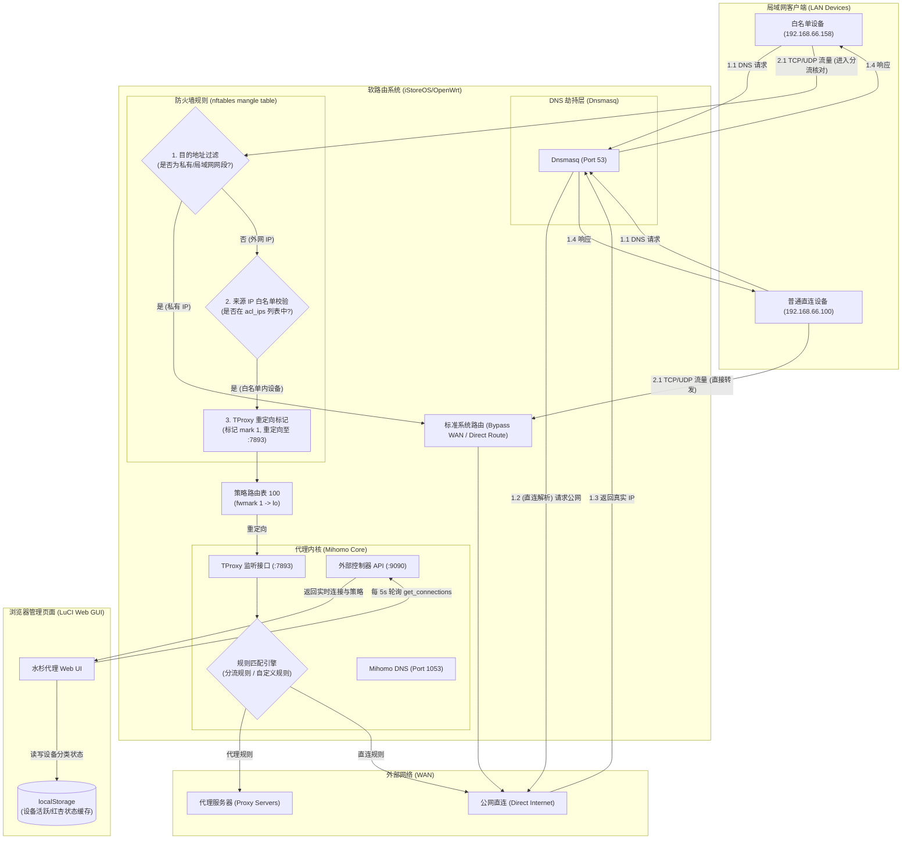
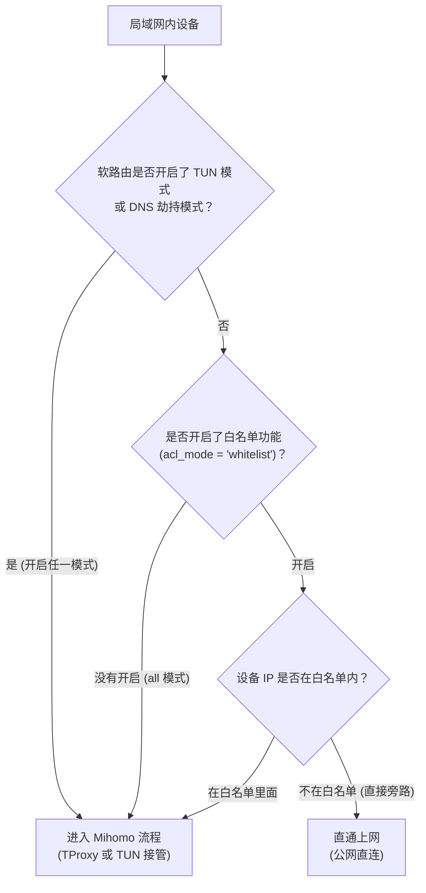

# 水杉代理 (luci-app-ssproxy) 数据流向与系统架构设计文档

本文档深入梳理了**水杉代理**（原 `luci-app-ssproxy`）在 OpenWrt/iStoreOS 软路由系统下的网络流量接管、分流处理、DNS 解析以及 LuCI Web GUI 访问日志的业务数据流向。

---

## 1. 核心架构与数据流向拓扑图

> 📌 **前置条件说明：** 本拓扑图展示的是**「白名单分流模式生效时（即关闭全局 DNS 劫持与 TUN 模式）」**的数据流向。若开启了全局 DNS 劫持或 TUN 模式，决策逻辑将强制转入全局接管，普通直连设备 `devB` 也会同等被导入 Mihomo。



---

## 2. 数据分流判定顺序

对于局域网内任意客户端设备发起的外网连接，系统在网络层判定其流向时，遵循以下严格的决策树逻辑（对应 [data.drawio](file:///Users/feng/Work/ipk2/docs/data.drawio) 设计）：



### 决策步骤说明：

1. **第一步（检测全局模式）**：
   * 系统首先检测 `tun_enabled` 与 `dns_hijack` 的状态。
   * **如果是**（即开启了 TUN 模式或 DNS 劫持）：IP 白名单界面锁定禁用（规则失效），强行将**所有设备**的数据包导入 Mihomo 进行全局处理。
   * **如果否**（两个模式均关闭）：继续向下进入白名单判定阶段。
2. **第二步（检测白名单开关）**：
   * 系统读取 `acl_mode`（IP 转发控制模式）的设置。
   * **如果是「所有设备」**（`acl_mode='all'`）：同样强行将**所有设备**的数据流量重定向到 Mihomo 代理。
   * **如果是「仅允许列表中的设备」**（`acl_mode='whitelist'`）：继续向下进入精准设备 IP 比对阶段。
3. **第三步（比对白名单列表）**：
   * **不在白名单列表的设备**：流量直接被防火墙旁路放行，完全不进入 Mihomo 流程，流量直接走 **直通网络**（直连公网）。
   * **在白名单列表内的设备**：流量经防火墙标记后重定向进入 Mihomo 透明代理。之后，Mihomo 会进一步根据用户配置的 **规则（如规则管理 / 自定义规则 / 分流规则）** 匹配出“代理转发”、“直连（Direct）”或“拦截（Reject）”动作并完成发送。

----

## 3. 数据流步骤详述

### 2.1 DNS 解析路径

在局域网客户端发起任何 TCP/UDP 网络连接之前，必须先发起域名 DNS 解析请求。解析路径取决于**「劫持系统 DNS」**（`dns_hijack`）选项的开关状态：

#### 场景 A：开启 DNS 劫持（全员接管模式）
1. 局域网客户端向路由器 Dnsmasq（`53` 端口）发送 DNS 请求。
2. Dnsmasq 被插件修改配置，将所有外网 DNS 查询上游强制转发至 **Mihomo DNS** 服务（`127.0.0.1#1053`），并启用 `noresolv=1`。
3. Mihomo DNS 处于 `fake-ip` 模式下，直接在本地地址池中为该域名分配一个 **Fake-IP**（例如 `198.18.0.12`），并将映射关系记录在内存中。
4. Dnsmasq 收到 Fake-IP 并回应客户端。
5. **依赖冲突控制：** 在此模式下，Web UI 白名单选择框会被锁定禁用（且值强制设为 `all`）。这是因为非白名单设备若拿到 Fake-IP 却无法通过防火墙转给 Mihomo 重定向，直连 WAN 会导致路由黑洞而断网。因此该模式下必须保证所有设备都通过代理内核。

#### 场景 B：关闭 DNS 劫持（白名单过滤模式）
1. 局域网客户端向路由器 Dnsmasq 发送 DNS 请求。
2. Dnsmasq 按 OpenWrt 原生配置，向 WAN 口配置的运营商 DNS 或公共 DNS（如 `223.5.5.5`）查询。
3. Dnsmasq 返回真实的**公网真实 IP**（Real-IP）给客户端。
4. **优势：** 不在白名单的直通设备拿到的是真实 IP，直接走 WAN 路由上网，不会有任何访问障碍。

---

### 2.2 TCP/UDP 流量控制路径（网络层与传输层）

当客户端向目标 IP（无论是 Real-IP 还是 Fake-IP）发起连接时，流量在路由器的 Linux 内核空间依次经过 `nftables` 防火墙和策略路由：

1. **目的地址过滤（Bypass Private Subnets）**：
   * 流量进入 nftables 的 `inet mihomo` 表的 `prerouting` 链。
   * 第一条规则检查目的 IP（`ip daddr`）。如果目的地是局域网私有/保留网段（如 `127.0.0.0/8`、`10.0.0.0/8`、`172.16.0.0/12`、`192.168.0.0/16`、`224.0.0.0/4`、`255.255.255.255/32`），防火墙执行 `return`（放行旁路），不进行任何劫持拦截，保证本地设备互访和路由器访问正常。
2. **源 IP 白名单过滤（Source IP Whitelist Filter）**：
   * 如果目的 IP 是公网地址，防火墙检查源 IP（`ip saddr`）。
   * **非白名单设备：** 匹配 `ip saddr != { acl_ips } return` 规则，执行 `return` 直接跳出该链，通过主路由表的默认网关直连 WAN 出网（走直通模式）。
   * **白名单内设备：** 无法匹配上述 `return` 规则，继续向下执行。
3. **TProxy 透明代理标记与重定向**：
   * 符合条件的流量匹配到透明代理规则：
     `meta l4proto { tcp, udp } tproxy to :7893 meta mark set 0x00000001`
   * 内核将数据包打上防火墙标记 `mark 1`，并将其重定向至本地运行的 Mihomo TProxy 端口（`7893`）。
4. **策略路由转交**：
   * Linux 策略路由（Policy Routing）检测到该数据包的 `fwmark` 为 `1`。
   * 命中策略路由规则：`ip rule add fwmark 1 table 100`。
   * 查询路由表 `100`（表内包含：`local default dev lo` 路由），将该数据包强行导入本地环回网卡（`lo`）。
   * 最终数据包进入 Mihomo Core 监听在 `7893` 端口的透明代理套接字（Socket）。

---

### 2.3 代理内核处理路径

Mihomo 接收到透明代理的 TCP/UDP 连接后：
1. **地址还原**：
   * 若目的地是 Fake-IP，在内置数据库中根据 Fake-IP 还原出其对应的真实域名。
   * 若目的地是 Real-IP，通过流量嗅探（Sniffing）提取 TLS Client Hello 中的 SNI 等信息获取目标域名。
2. **分流规则匹配**：
   * 根据还原出的域名或目的 IP，进入 `rule_engine` 匹配分流策略。
   * **DIRECT**：将流量通过本地 WAN 网卡直接向公网发起连接。
   * **REJECT**：直接拦截并丢弃该数据包。
   * **PROXY**：将连接打包加密，通过代理协议（VMess/Shadowsocks/Trojan/VLESS 等）转发到远端代理节点。

---

## 3. LuCI 访问日志数据交互流

Web 管理面和运行日志的数据采集与展示完全基于前端 JS 和单体后端（`helper.sh`）的协同：

```
[ 软路由后台运行 ]
Mihomo 核心运行  --> (连接状态) -- [Helper.sh collect_loop] (每15秒增量写入) --> /tmp/mihomo_access.log
                                                                                       |
[ 浏览器前台交互 ]                                                                      v
水杉代理 Web UI  -- (fs.exec 每 5 秒轮询) --> [Helper.sh get_history / get_connections] 
      |
      +---> (计算连接策略，分类状态)
      |
      v
[ 浏览器 localStorage ] (持久化设备 IP 与「红杏」状态)
```

1. **增量日志落盘**：
   * 服务启动时，后台通过 `procd` 额外拉起了一个连接采集守护进程：`/usr/share/mihomo/helper.sh collect_loop`。
   * 该守护进程每 15 秒向 Mihomo 内部控制器 API（`9090/connections`）拉取一次活跃连接。
   * 使用 `awk` 与 `jsonfilter` 对新连接去重，将其追加持久化落盘到临时日志文件 `/tmp/mihomo_access.log` 中。
2. **Web 页面轮询**：
   * 用户打开「访问日志」页面时，浏览器 JS（`accesslog.js`）每 5 秒发起一次 RPC 调用：
     * 执行 `/usr/share/mihomo/helper.sh get_connections` 获取当前完全实时的活跃连接。
     * 执行 `/usr/share/mihomo/helper.sh get_history` 读取落盘的历史记录。
3. **设备「红杏」出墙判定逻辑**：
   * 浏览器拿到连接数据后，触发 `updateTrackedDevices(connections, history)`：
     * 从本地 `localStorage` 读取已保存的设备列表字典。
     * 提取每个连接的源 IP（`ip`）与设备名（`device`），并对未记录的 IP 初始化为 **「设备（直通/直连）」** 状态。
     * 解析连接的出口策略（`policy`）。如果其出站策略**不属于**直连或拦截列表（即非 `direct`、`reject`、`block`、`-`、`""`），则判定该设备产生了代理行为，**永久将其标记为「红杏（走代理）」**。
     * 将更新后的数据重新回写到 `localStorage` 中并重新渲染 IP 列表板块。

---

## 4. 边界设计与鲁棒性考量

1. **清理残留，保证幂等**：
   * 在旧版本中，如果在关闭 DNS 劫持或变更白名单时重启服务，`stop_service` 常常因为读取新配置而跳过了对旧网络规则的清理，造成规则残留。
   * 新设计在 `stop_service` 中**无条件强制执行** `disable_tproxy` 和 `disable_dns_hijack`，即使配置已变更，也能保障路由器退回到干净的直连状态。
2. **nftables 表完整重置**：
   * `enable_tproxy` 在应用规则时，采用 `nft delete table inet mihomo 2>/dev/null` 先清除旧表，再通过 `nft add table inet mihomo` 重新创建的模式。
   * 彻底避免了因重复应用配置或多次启动导致 `nftables` 规则不断在 prerouting 链尾部追加造成的规则屏蔽和配置失效问题。
