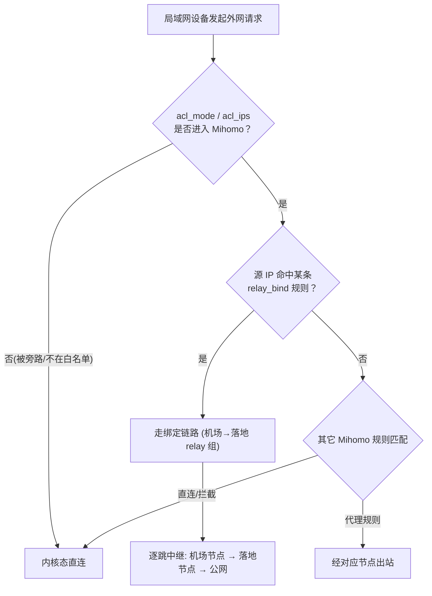

# 链式代理（Relay 多跳）+ 设备链路绑定 产品设计文档

> 状态：**已实现**（随 `v1.0.0-166` 一同提供）
> 模块：`luci-app-ssproxy` → 「服务设置」内的「链式代理」与「设备链路绑定」区段 + 「运行状态」页面内的 relay 策略组实时切换区
> 适用：OpenWrt + LuCI，需 Mihomo 核心已下载；设备级分流依赖核心已启动且外部控制器 `127.0.0.1:9090` 可达
> 关联文档：`docs/proxy-group-management-design.md`（Selector 组热切换）、`产品设计文档.md` §5（分流决策）

---

## 1. 文档信息

| 项 | 内容 |
| --- | --- |
| 功能定位 | 把多个节点/策略组按顺序串联成一条「链式代理（relay）」，并支持把指定局域网设备（按 IP/CIDR）的流量绑定到某条链路 |
| 入口路径 | LuCI → 服务 → Mihomo 代理 → 服务设置 →「链式代理 (Relay 多跳)」/「设备链路绑定」；运行状态 →「分流策略组管理」中实时切换各跳 |
| 核心能力 | ① 定义多跳 relay 组（如 机场节点 → 落地点）；② 按本机 IP/网段把流量路由到指定链路；③ 仪表盘逐跳热切换 |
| 实现载体 | `helper.sh`：`collect_proxy_names` / `emit_relay_groups_yaml` / `emit_relay_bind_rules_yaml` / `select_relay` 子命令 + `dashboard.js` 的 relay 渲染分支 + `settings.js` 的两个 `TypedSection` |
| 数据源 | UCI `relay_chain` / `relay_bind` 段；relay 组由 `prepare_config` 注入运行配置；切换走 Mihomo 控制器 `PUT /proxies/{group}` |
| 变更生效 | 链路定义与设备绑定**需重启核心**（`prepare_config` 重新生成 `/tmp/mihomo_run.yaml`）；切换链路中的某一跳**即时热生效**（控制器 PUT，不断流） |

---

## 2. 背景与目标

订阅通常只提供单跳节点（机场出口）。部分场景下用户希望流量**先走订阅机场、再走一个落地/中转节点**，或对**不同设备**强制走不同的出口链路（例如客厅电视走香港落地、NAS 走日本落地）。

Mihomo 原生支持 `type: relay` 的代理组——把多个出站代理按顺序串联，出站时逐跳中继。本功能在插件里把 relay 从「只能手写 YAML」变成「可在 LuCI 里配置 + 实时切换」，并补上「按设备分流到链路」这一层，使最终的诉求——

> *本地不同设备（不同 IP），先走订阅的机场，然后走落地的链式代理*

——可以直接在路由器管理界面完成，无需触碰 YAML、无需第三方控制台。

---

## 3. 关键决策（已确认）

| # | 决策点 | 结论 |
| --- | --- | --- |
| 1 | 形态 | relay 代理组：UCI 定义链路名 + 有序跳列表，后端注入 `type: relay` 代理组 |
| 2 | 跳的内容 | 每跳可填**订阅中的节点名**，或**已有的策略组名**（两者都在 Mihomo 的代理命名空间内，relay 可串联组） |
| 3 | 候选池 | 注入的 relay 组 `proxies:` 取运行配置里全部节点名 + 全部组名，使每一跳都能在仪表盘切到任意节点/组 |
| 4 | 设备绑定方式 | 生成 `SRC-IP-CIDR,<设备IP>,<链路名>` 规则，注入运行配置 `rules:` 顶部（高优先级、先匹配） |
| 5 | 设备绑定生效条件 | 设备流量须先进入 Mihomo：`acl_mode=all` 时天然满足；`whitelist` 模式下须同时把该设备加入 `acl_ips` |
| 6 | 切换生效 | 定义/绑定改动走 `prepare_config` + 重启核心；切换链路中的某一跳走控制器 PUT，即时热生效、不断流 |
| 7 | 校验 | 跳节点不存在、或绑定指向未定义/未启用的链路时，后端 `logger` 告警并**跳过该项**，避免产生非法 YAML 拖垮核心启动 |

---

## 4. 总体架构

```
 +---------------------------------------------------+
 |  settings.js (UCI 表单)                            |
 |   relay_chain 区段:  name / enabled / hops[]       |
 |   relay_bind  区段:  enabled / src_ip / chain      |
 +----+----------------------------+------------------+
      | 保存 UCI                    | 保存 UCI
      v                             v
 +---------------------------------------------------+
 |  /etc/config/mihomo  (conffile, 升级保留)          |
 +---------------------------------------------------+
      |  prepare_config (核心启动前)
      v
 +---------------------------------------------------+
 |  helper.sh                                        |
 |   collect_proxy_names        -> 节点+组名清单      |
 |   emit_relay_groups_yaml      -> 注入 relay 组     |
 |       (拼入 proxy-groups 块, 或追加)               |
 |   emit_relay_bind_rules_yaml  -> SRC-IP-CIDR 规则  |
 |       (注入 rules 块顶部)                          |
 +---------------------------------------------------+
      |  生成 /tmp/mihomo_run.yaml
      v
 +---------------------------------------------------+
 |  Mihomo 核心 (9090 控制器)                          |
 |   代理组列表中含 type:relay 的链路                  |
 +---------------------------------------------------+
      ^  GET/PUT /proxies/{group}
      |
 +---------------------------------------------------+
 |  dashboard.js  (运行状态)                           |
 |   渲染 relay 组, 每跳一个下拉; change -> select_relay|
 +---------------------------------------------------+
```

---

## 5. 核心机制详解

### 5.1 UCI 配置模型

两类命名段（均为 `conffile` `/etc/config/mihomo` 的一部分，升级/重装保留）：

```uci
config relay_chain 'cfg1'
    option enabled  '1'
    option name     'HK落地链'
    list   hops     '机场节点X'
    list   hops     '落地节点B'

config relay_bind 'cfg2'
    option enabled '1'
    option src_ip  '192.168.1.100'
    option chain   'HK落地链'
```

- `relay_chain`：`name` 即 relay 组在 Mihomo 中的显示名；`hops` 为**有序**跳列表（顺序即链路顺序）；`enabled` 关闭则不注入。
- `relay_bind`：`src_ip` 支持单 IP（`192.168.1.100`）或 CIDR（`192.168.1.0/24`）；`chain` 必须对应某个已启用 `relay_chain` 的 `name`。

### 5.2 relay 组注入（`emit_relay_groups_yaml`）

`prepare_config` 在拼装完运行配置后调用：

1. `collect_proxy_names` 从运行配置抽取**全部节点名**（`proxies:` 块）与**全部组名**（`proxy-groups:` 块），作为候选池。
2. 遍历启用的 `relay_chain`：校验每一跳都存在于候选池（不存在则 `logger` 告警并跳过该链）。
3. 输出 relay 组的列表项：

```yaml
  - name: "HK落地链"
    type: relay
    proxies:
      - "机场节点X"
      - "落地节点B"
      - "自动选择"
```

4. 若运行配置已有 `proxy-groups:` 块，用 awk 把上述项**拼接到块内顶部**；否则在文件末尾新建 `proxy-groups:` 块追加。避免重复顶层键导致核心 FATAL。

> 候选池取「全部节点 + 全部组名」，因此仪表盘里每一跳都能切换到任意节点/组，链路顺序由用户初始 `hops` 与运行时的逐跳选择共同决定。

### 5.3 设备链路绑定规则（`emit_relay_bind_rules_yaml`）

在 `prepare_config` 的规则拼装阶段、`emit_builtin_bypass_rules` 之后、`emit_access_rules_yaml` 之前调用，生成的 `SRC-IP-CIDR` 规则落在 `rules:` 块**顶部**（最高优先、先匹配）：

```yaml
  - 'SRC-IP-CIDR,192.168.1.100/32,HK落地链'
  - 'SRC-IP-CIDR,192.168.1.0/24,HK落地链'
```

绑定目标须是已启用 `relay_chain` 的 `name`；否则 `logger` 告警并跳过（防止指向不存在的组导致核心启动失败）。单 IP 自动补 `/32`。

### 5.4 仪表盘逐跳热切换（`select_relay`）

`dashboard.js` 对 `type: relay` 的组，按 `g.all`（Mihomo 返回的二维数组，每跳一个候选列表）渲染 N 个下拉框，初始选中由 `g.now`（逗号串）还原。

任一跳改变时，收集该组全部下拉的当前值组成 JSON 数组，调用：

```bash
helper.sh select_relay "<链路名>" '["机场节点X","落地节点B"]'
```

后端 `select_relay` 以 `PUT /proxies/{group}` 发送 `{"name":[...]}`，切换在核心内存中即时完成、不断流。与 Selector 组的 `select_node`（发送单字符串）不同，relay 需要发送**整条链路数组**。

### 5.5 面板可见条件

「分流策略组管理」面板在「控制器可达 且（存在 Selector 组 或 存在 relay 组）」时显示；relay 组以紫色 `RELAY` 徽标与 Selector 组（青色 `SELECTOR`）区分。

---

## 6. 分流决策（按设备走链路）



**要点**：设备绑定不改变「设备是否进代理」的判定（那由 `acl_mode`/`acl_ips` 在 tproxy/DNS 层决定），只决定「进代理后走哪条链路」。因此 `whitelist` 模式下，被绑定的设备必须同时出现在 `acl_ips` 中，否则其流量在进 Mihomo 前就被旁路，绑定规则永不命中。

---

## 7. LuCI 前端

| 视图 | 区段 / 能力 |
| --- | --- |
| `settings.js` | **链式代理 (Relay 多跳)** `TypedSection`（`addremove`，可增删多条链路）：`name` / `enabled` / `hops`（`DynamicList`，按顺序填节点或组名） |
| `settings.js` | **设备链路绑定** `TypedSection`：`enabled` / `src_ip`（本机 IP 或 CIDR）/ `chain`（`ListValue`，选项由 `uci.sections('mihomo','relay_chain')` 动态填充） |
| `dashboard.js` | 「分流策略组管理」中渲染 relay 组：每跳一个下拉框，变更即 `select_relay` 整条链路热切换；面板在存在 relay 组时显示 |

> `chain` 下拉选项依赖 `relay_chain` 段已先定义；建议先配链路、再配绑定。两类区段保存后均**需重启核心**生效（走 `prepare_config` 重新生成运行配置）。

---

## 8. 生效与限制

- **链路定义 / 设备绑定**：保存 UCI 后重启核心 → `prepare_config` 重新生成 `/tmp/mihomo_run.yaml`，relay 组与 `SRC-IP-CIDR` 规则才生效。
- **逐跳切换**：在「运行状态」里改某一跳，即时热生效、不重启、不断流；但**不写 UCI**，核心重启后回到 `hops` 定义的默认链路（Mihomo 原生行为）。
- **跳节点名区分大小写**，须与订阅/运行配置中的 `name` 完全一致；填错（不存在）的链路会在 `prepare_config` 阶段被跳过并告警，不会拖垮核心。
- **设备绑定与白名单共存**：`whitelist` 模式下被绑定设备须同时在 `acl_ips`；否则绑定规则不命中（见 §6）。
- relay 组的 `proxies` 候选池为运行配置中的全部节点与组名，因此可切换范围较宽；若只想限定特定节点，可在订阅/自定义里缩减，或在仪表盘只选需要的跳。

---

## 9. 验证摘要

- `sh -n` 校验 `helper.sh` 通过；`node --check` 校验 `dashboard.js` / `settings.js` 通过。
- 用 mock 运行配置实测：`emit_relay_groups_yaml` 正确注入 relay 组（按启停跳过禁用链、按候选池跳过无效跳）；`emit_relay_bind_rules_yaml` 正确生成 `SRC-IP-CIDR` 规则（未知链路跳过、单 IP 自动补 `/32`）。
- 注入后的运行配置经 `yaml.safe_load` 解析为合法结构，`proxy-groups` / `rules` 均无重复顶层键、格式正确。

---

## 10. 相关文档

| 文档 | 内容 |
| --- | --- |
| `docs/proxy-group-management-design.md` | Selector 策略组热切换设计（本功能 relay 切换的同页扩展） |
| `产品设计文档.md` | 插件总设计、分流决策树（§5）、配置合并 `prepare_config`（§6.3） |
| `docs/whitelist-dns-coexistence-design.md` | 白名单 + DNS 劫持共存（设备绑定在 whitelist 模式下的前置条件） |
