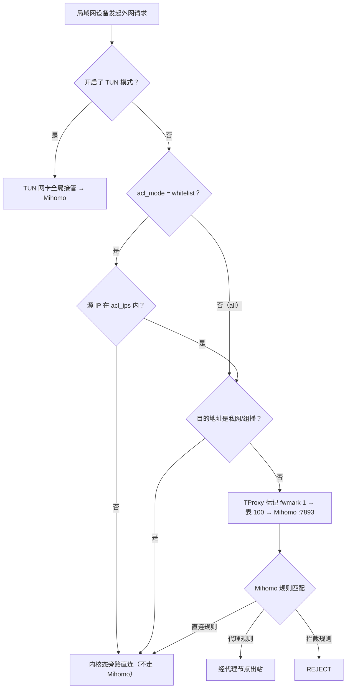
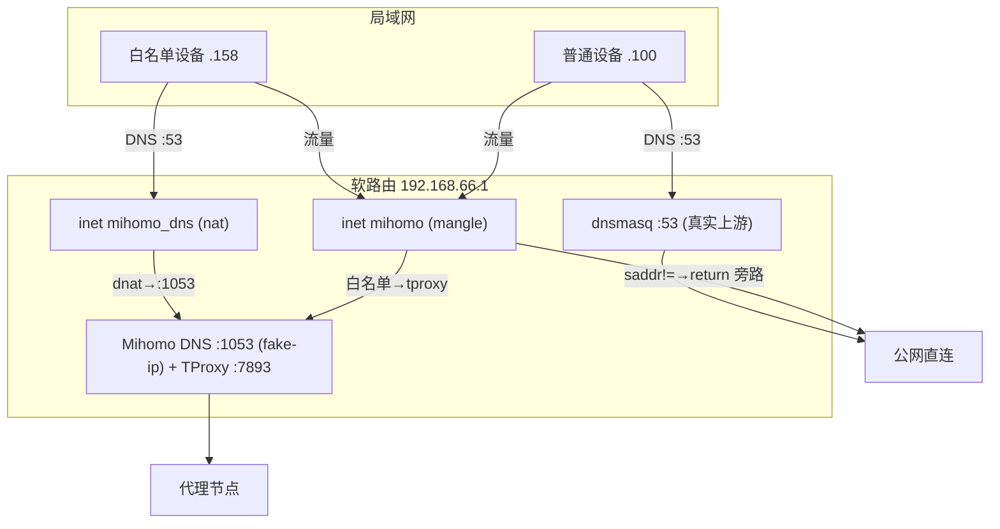

# 水杉代理 (luci-app-ssproxy) 产品设计文档

> 版本：1.0.0-160　·　最后更新：2026-07-19　·　状态：与代码同步
>
> 本文是**整个插件**的权威设计文档，覆盖产品定位、功能矩阵、系统架构、数据流与分流决策、各核心模块的机制实现、安全/性能/限制与路线图。各功能的细化设计散见于 `Docs/` 下其它文档，文末「相关文档」给出索引。

---

## 1. 产品定位

**水杉代理**（包名 `luci-app-ssproxy`）是一款面向 iStoreOS / OpenWrt（Firewall4 + nftables）的 LuCI 应用，作为 [Mihomo (Clash Meta)](https://github.com/MetaCubeX/mihomo) 代理核心的前端，在软路由网关上提供**透明代理**能力。

与「装在每台终端上的代理客户端」不同，它把代理能力下沉到网关：局域网设备无需任何配置，经过路由器的流量即被按规则分流（代理 / 直连 / 拦截）。核心一句话：

> 在网关侧用 TProxy 透明接管流量 + 用 fake-ip DNS 解决域名分流，配合订阅自动更新、节点延时测试、访问日志、自定义规则与按设备白名单，做到「装一次、全网通、可观测、可管控」。

设计原则：

- **零终端配置**：所有逻辑在网关内核态（nftables）与用户态（Mihomo）完成。
- **可观测**：实时连接、历史访问、流量统计层层可见。
- **可管控**：从「全员代理」到「仅指定设备代理」可平滑切换，且与 DNS 劫持共存。
- **自包含、可复现**：单源文件构建，无外部编译依赖；构建产物逐字节可复现。

---

## 2. 目标用户与场景

| 用户画像 | 典型场景 | 本插件价值 |
| :--- | :--- | :--- |
| 家庭/SOHO 极客 | 软路由全局科学上网，部分设备走代理、其余直连 | TProxy 全局接管 + 按设备白名单 + DNS 劫持共存 |
| 多终端家庭 | 手机/电视/NAS 混用，只想让特定设备走代理 | 受控 IP 列表，非列表设备内核态直连、零开销 |
| 开发者/运维 | 调试分流规则、排查「为什么没走代理」 | 实时连接 + 历史访问 + 一键加规则 + 流量统计 |
| 商用/二次分发 | 打包给客户、需可控可运营 | 控制器密钥、Geo 数据库管理、节点选择持久化 |

典型部署：一台 iStoreOS/OpenWrt 软路由作为局域网网关（如 `192.168.66.1`），导入订阅后即用。

---

## 3. 功能矩阵

### 3.1 代理与分流

- **TProxy 透明代理**：nftables `inet mihomo` 表 + 策略路由表 100（fwmark 1），TCP/UDP 透明接管，**无需 TUN**；IPv4 + IPv6 双栈。
- **TUN 模式（可选）**：虚拟网卡全局接管，更彻底但 CPU 略高；与白名单互斥。
- **DNS 劫持**：默认全局（dnsmasq 转发到 Mihomo fake-ip DNS）；白名单模式下按源地址作用域（见 §5.2）。
- **Mihomo 核心**：内置下载 `v1.19.28`（支持 anytls 等新型代理），含 `cpu_amd64_v3` 检测区分 AVX2/BMI2。
- **外部控制器**：9090 端口 API；密钥可自动生成随机值（见 §6.8）。

### 3.2 访问控制

- **IP 转发控制模式**：`all`（所有设备）/ `whitelist`（仅允许列表中的设备）。
- **受控 IP 列表** `acl_ips`：支持 IPv4/IPv6 地址与 CIDR（如 `192.168.66.158`、`192.168.66.0/24`、`fd00::158`）。
- **白名单 + DNS 劫持共存**：仅白名单设备 DNS 被 fake-ip 重定向并走代理，其余设备真实 DNS 直连（见 §5.2）。

### 3.3 订阅与配置

- **订阅自动更新**：自包含守护循环（每 10 分钟轮询、按小时间隔节流），不依赖系统 cron。
- **订阅链接持久化**：保存到包外 `/etc/mihomo/.subscription_url`，**即使 opkg 卸载重装也能恢复**。
- **配置模式切换**：订阅 / 仅自定义 / 混合（自定义规则追加到订阅规则之后）。
- **配置合并** `prepare_config`：拷贝订阅 YAML 到 `/tmp/mihomo_run.yaml`，删原 `dns:`/`tun:`/端口，前置受控端口、追加受控 DNS/TUN 块，再注入 UCI 规则——UCI 的端口/DNS/TUN/规则设置才真正生效。

### 3.4 节点与延时

- **策略组实时切换**：仪表盘热切换出站组，选择结果**持久化**（重启不丢）。
- **节点延时测试**：单节点 + 全量批量（`test_all_nodes` 有限并发一次跑完，替代旧版前端每节点一个 fs.exec 打满 rpcd 的设计）。
- **连通性测试 / 自动选节点**。

### 3.5 访问日志

- **单一日志表**：只展示网络访问记录，包括时间、设备/IP、域名/目标、出站策略与上下行流量。
- **增量去重**：后台采集活跃连接并写入 `/tmp/mihomo_access.log`，最多保留最近 2000 条。
- **可清空**：页面标题栏提供「清空」按钮，通过 `clear_access_log` 删除已采集记录。
- **旧数据修复**：自动识别旧版未换行导致的非法 JSON 超长日志并清理。

### 3.6 规则管理

- **UCI `mihomo_rule` 段**：类型（域名/关键字/后缀）× 动作（代理/直连/拦截）；代理动作可指定目标策略组。
- **增删 / 清空 / 批量导入**（覆盖或追加）。
- **一键「应用并重启」**：规则注入核心分流 `rules:` 段**最顶部**，最高优先匹配。
- 注：Mihomo 规则是**全局**的，记录的 `src_ip` 仅用于管理追溯，不按来源 IP 生效。

### 3.7 流量统计

- **按域名分桶**（可清零）+ 永不清零的累计总量。
- **按天 / 按月汇总**永久存储列表（北京时间）。

### 3.8 商业化加固

- **控制器密钥**：留空则下次启动自动生成随机 secret 并持久化。
- **Geo 数据库管理**：GeoIP/GeoSite 镜像地址 + 自动更新周期，离线/首启也可用 GEOIP/GEOSITE 规则。
- **节点选择持久化**：策略组选择跨重启保留。

---

## 4. 系统架构

### 4.1 单源真相构建

仓库**只有一个源文件** `build_ipk.py`：它既是构建器，又以字符串形式内嵌全部要打包的文件（shell 脚本、UCI 配置、LuCI JS 视图、JSON），集中在顶部 `src_files` 字典。

- 改任何交付文件 = 改 `src_files` 里对应字符串，再 `python3 build_ipk.py`。
- `src/`、`build/`、`dist/` 全部由构建**先删后建**生成，是纯产物，**切勿手编**。
- 可复现构建：`make_tar_gz` 强制 root:root、`mtime=1700000000`、`./` 前缀、排序条目；脚本类 `0o755`，其余 `0o644`。`tests/test_reproducibility.py` 断言逐字节一致。
- 每次构建 `main()` 第一步 `increment_version()` 自增 `PKG_VERSION`（如 `1.0.0-160 → 161`）并原地重写脚本；同时 `generate_release_note()` 从 git 提取本次变更写入 `dist/releaseNote.md`（基线记录于 `.release_baseline`）。

### 4.2 运行时拓扑（procd 多实例）

`/etc/init.d/mihomo`（`START=95`）拉起 **4 个 procd 实例**：

1. **核心**：`restore_subscription_url` → `prepare_config` 生成 `/tmp/mihomo_run.yaml` → 以 `-f /tmp/mihomo_run.yaml` 启动核心 → 非 TUN 时 `enable_tproxy` → 按需 `enable_dns_hijack`。
2. **连接采集器**：`collect_loop` 每 15s 去重持久化连接到 `/tmp/mihomo_access.log`。
3. **自动更新循环**：`auto_update_loop` 每 10 分钟轮询 `auto_update_now`（自包含，不依赖 cron）。
4. **流量统计循环**：`traffic_loop` 每 5s 累计代理字节到总量 + 可清零的按域名桶。

`/usr/share/mihomo/helper.sh` 是单体后端，`case "$1"` 分发约 30 个子命令（架构/订阅/自动更新/配置合并/实时控制/访问规则/流量统计/Geo）。

### 4.3 关键文件与目录

| 路径 | 作用 |
| :--- | :--- |
| `/etc/init.d/mihomo` | procd 编排（tproxy/dns/采集/更新/流量） |
| `/usr/share/mihomo/helper.sh` | 单体后端（~30 子命令） |
| `/etc/config/mihomo` | UCI 主配置（conffile，升级保留） |
| `/etc/mihomo/config.yaml` | 订阅原始配置 |
| `/etc/mihomo/.subscription_url` | 订阅链接持久化（包外） |
| `/tmp/mihomo_run.yaml` | 运行配置（核心实际加载） |
| `/tmp/mihomo_access.log` | 历史访问 |
| `/tmp/mihomo_core.log` | 核心 stdout/stderr（启动失败可见） |

---

## 5. 数据流与分流决策

### 5.1 三种运行模式

| 模式 | tproxy 表 | DNS | 适用 |
| :--- | :--- | :--- | :--- |
| **A. all + dns=1**（默认） | daddr 私网 return + tproxy 兜底 | 全局 dnsmasq→Mihomo | 全员代理，最常用 |
| **B. whitelist + dns=0** | + `saddr != {...} return` | 不动 | 仅白名单走代理、无 fake-ip |
| **C. whitelist + dns=1**（新） | + 白名单 DNS 放行 + `saddr != {...} return` | 按源 dnat 到 Mihomo | 仅白名单走代理、且享 fake-ip |
| **D. TUN** | 不建 tproxy 表 | 由 TUN 接管 | 全局虚拟网卡接管 |

### 5.2 白名单 + DNS 劫持共存（v1.0.0-160 新增）

**背景**：此前 `dns_hijack=1` 会把 `acl_mode` 静默强转为 `all`，白名单完全失效。根因是 DNS 劫持走**全局** dnsmasq 转发——所有客户端都拿到 fake-ip，而非白名单设备拿到 fake-ip 却不被 tproxy → 直连不存在地址 → 断网。

**机制**：把 DNS 劫持从「全局 dnsmasq」改为「按源 IP 作用域的 nft DNAT」。新增独立表 `inet mihomo_dns`（nat prerouting，priority dstnat）：

- `inet mihomo`（mangle，-150）里先放行白名单设备的 53 端口（`ip/ip6 saddr { acl } tcp/udp dport 53 return`），让其 DNS **不进 tproxy**；
- 再 `ip/ip6 saddr != { acl } return` 旁路非白名单设备；
- `inet mihomo_dns`（nat，-100）里 `dnat` 白名单设备的 53 到 `<路由器 LAN IP>:1053`（Mihomo DNS）。

hook 优先级保证 mangle（-150）先于 nat（-100），mangle 的 `return` 不影响后续 nat 钩子，故「放行 → dnat」链路成立。用 **dnat 而非 redirect**：redirect 只匹配目标是本机的包，硬编码 DNS（如 `8.8.8.8`）会漏；dnat 按源无条件改写，全兜住。路由器 LAN IP 由 `helper.sh get_lan_ip`/`get_lan_ip6` 探测（UCI→接口→全局→默认路由源）。

**效果**（路由器实测）：白名单设备解析 `google.com` 得 `198.18.x.x`（fake-ip）经代理；非白名单设备得真实公网 IP 直连。`uci show dhcp.@dnsmasq[0]` 不再含 `127.0.0.1#1053`（非白名单保留真实上游）。

**回退**：检测不到 LAN IP 或 `acl_ips` 为空时，不建 DNS 表、退回全局 `enable_dns_hijack`（all 模式 DNS），保证不断网。

### 5.3 分流决策树



### 5.4 数据流图（whitelist + dns_hijack 共存模式）



---

## 6. 核心机制详解

### 6.1 TProxy 透明代理

nft 规则由 `helper.sh: emit_tproxy_rules` 纯函数生成（按模式输出，`nft -f -` 一次应用），`init.d: enable_tproxy` 调用。规则顺序（whitelist+dns 为例）：

1. `ip/ip6 daddr { 私网/组播 } return`（私网直连）
2. `ip/ip6 saddr { acl } tcp/udp dport 53 return`（白名单 DNS 放行，交 nat）
3. `ip/ip6 saddr != { acl } return`（非白名单旁路）
4. `meta l4proto { tcp,udp } tproxy to :7893 meta mark set 1`（兜底接管）

策略路由：`ip rule add fwmark 1 table 100` + `ip route add local default dev lo table 100`（IPv4 与 IPv6 各一套）。停止时 `disable_tproxy` 删除两张 nft 表与两族路由。

### 6.2 DNS 劫持

- **全局**（all/TUN/降级）：`enable_dns_hijack` 改 `dhcp.@dnsmasq[0].server=127.0.0.1#1053` + `noresolv=1`。
- **按源**（whitelist+dns）：见 §5.2，nft DNAT，**不动 dnsmasq**。
- DNS 块由 `prepare_config` 注入：`listen 0.0.0.0:1053`、`enhanced-mode: fake-ip`、`ipv6: true`。

### 6.3 订阅与配置合并（`prepare_config`）

拷贝订阅 → awk 删原 `dns:`/`tun:` 块 → sed 删顶层端口/controller → 前置受控端口 → 追加受控 `dns:`/`tun:` 块 → `emit_builtin_bypass_rules`（组播/LLMNR → DIRECT）+ `emit_access_rules_yaml`（UCI 规则）注入 `rules:` 顶部。

### 6.4 规则管理（UCI `mihomo_rule`）

`emit_access_rules_yaml` 遍历启用的规则段，按类型映射 `DOMAIN/DOMAIN-KEYWORD/DOMAIN-SUFFIX`、按动作映射 `REJECT/DIRECT/<group>`；代理动作前用 `rule_target_exists` 校验目标组存在（避免指向不存在的组导致核心 FATAL 启动失败，发现则跳过并 `logger` 告警）。

### 6.5 节点延时测试

`test_all_nodes` 在后端用**有限并发**一次跑完全量节点延时（每节点 `test_url` 可配，并对节点名做 `resolve_proxy_name` 容错匹配，容忍订阅与运行配置间的引号/CRLF 差异）。替代了旧版前端每节点一个 `fs.exec`（30 路并发）打满 rpcd/file-exec 超时的设计——新增批量需求沿用此后端批量模式。

### 6.6 访问日志

实时走 9090 `connections` API；历史走 `collect_loop` 每 15s 去重落盘。展示用 `awk` 实现逆序/编号，规避 BusyBox 裁剪 `tac`/`nl`。

### 6.7 流量统计

`traffic_loop` 每 5s 累计 `chains[0] != DIRECT` 的字节差到「永不清零总量」+「可清零按域名桶」；并按北京时间聚合「按天/按月」永久存储列表。

### 6.8 商业化加固

- **密钥**：`secret` 留空则 `prepare_config` 生成随机串并持久化。
- **Geo**：`geox-url` 指向镜像 + `geo-auto-update` + `geo-update-interval`，离线首启也可用 GEOIP/GEOSITE。
- **持久化**：策略组选择、订阅链接均跨重启/重装保留。

---

## 7. LuCI 前端（7 视图，纯 JS，无 npm/无编译）

| 视图 | 职责 |
| :--- | :--- |
| `dashboard.js` | 运行状态 + 策略组热切换 + 节点卡片/延时/清空 + 自动更新排程 + 核心管理 + 日志 + 版本号 |
| `settings.js` | UCI 表单：订阅/自动更新/更新间隔/延时 URL/TUN/DNS 劫持/IP 转发控制(含白名单)/高级端口路径/密钥/Geo |
| `chain.js` | 落地节点 CRUD + 设备 IP / 订阅节点 / 落地节点三列表 + 状态、日志与链路测试 |
| `accesslog.js` | 实时连接 5s 刷新 + 历史 + 快捷追加规则（自带 setInterval 与 unload 清理） |
| `rules.js` | 自定义规则管理：增删/清空/批量导入/应用并重启 |
| `traffic.js` | 代理流量总量、按域名、按日和按月统计 |
| `adblock.js` | 广告过滤开关和规则源管理 |

菜单在 `menu.d/*.json` 注册；`rpcd/acl.d/*.json` 授予 helper.sh/logread/init.d 的 exec 权限。

---

## 8. 构建与部署闭环

```bash
python3 build_ipk.py && ./deploy.sh
```

- `build_ipk.py`：自增版本 → 重建 `src/` → 擦除 `build/`+`dist/` → 生成 control/data tar → 组装 `.ipk` → 生成 `releaseNote.md`。
- `deploy.sh`：macOS `expect` 喂密码，SCP 上传 `/tmp/` → SSH `opkg install` → 重启 `mihomo`。
- 规则：每次构建新版本后**必须**部署安装到软路由，保证远程测试环境与本地代码同步。
- 测试：`tests/` pytest 套件（构建器 + `helper.sh` 黑盒），新增批量需求应顺带补单测。

---

## 9. 安全考量

- 控制器 9090 默认生成随机密钥，避免裸 API 被局域网任意调用。
- DNS 按源 DNAT 仅作用于白名单设备，非白名单设备 DNS 路径不受影响（减少误伤）。
- 规则目标组校验避免错误配置拖垮核心。
- conffile 保护用户订阅链接不被升级覆盖。

## 10. 性能与资源

- 非白名单设备在**内核态** `return` 旁路，零用户态开销。
- 流量采集/延时测试采用后端批量、有限并发，避免打满 rpcd。
- 全部 shell 用 `awk`/`sed`/`nft`/`ip` 等原生工具，无 Python/Node 运行时依赖。

## 11. 已知限制

- Mihomo 规则**全局**生效，`mihomo_rule.src_ip` 仅管理追溯用，不按来源 IP 生效；按设备分流靠 `acl_ips` 白名单（tproxy/dns 层）。
- IPv6：fake-ip 仅 IPv4（`fake-ip-range` 默认 `198.18.0.1/16`），IPv6 走真实 AAAA + tproxy；需核心在 v6 上监听 tproxy（`:::7893`，实测已绑定）。
- 自定义 `acl_ips` 去掉了前端 `ipaddr` 校验以接受 CIDR/v6，错误输入会在 `nft -f -` 应用时报错（仪表盘可见核心日志）。
- TUN 模式与白名单互斥（TUN 为全局接管）。

## 12. 路线图（建议）

- 规则按来源 IP 生效（若 Mihomo 支持 `src-ip` 条件）。
- IPv6 fake-ip（待 Mihomo 支持）。
- 访问日志可视化（流量趋势图）。
- 多订阅/节点分组聚合。

## 13. 相关文档

| 文档 | 内容 |
| :--- | :--- |
| `CLAUDE.md` | 开发者规范、构建/部署、单源架构、shell 转义约定 |
| `README.md` | 项目总览、快速开始 |
| `CHANGELOG.md` | 历史变更汇总 |
| `Docs/whitelist-dns-coexistence-design.md` | 白名单 + DNS 劫持共存设计（本文 §5.2 的细化） |
| `Docs/whitelist-test-cases.md` | 分流与服务控制测试用例（TC-01~TC-06） |
| `Docs/data-flow-design.md` | 数据流向与系统架构（早期版本） |
| `Docs/config-rules-guide.md` | 订阅配置与分流规则说明 |
| `Docs/access-log-design.md` | 访问日志产品设计 |
| `Docs/proxy-group-management-design.md` | 策略组管理设计 |
| `Docs/chain-proxy-product-design.md` | 链式代理：落地节点资产 + 设备数据链路设计 |
| `Docs/LuCI插件自动化闭环开发流程.md` | 通用自包含 LuCI 插件开发指南 |
| `Docs/closed-loop-workflow.md` | 自动化闭环开发流程 |
